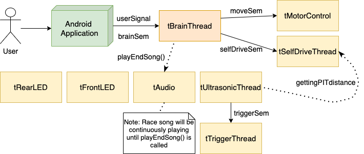
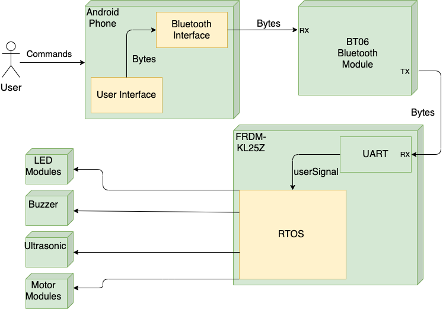

# CG2271 RTOS-based Robotic Car

  
  

## Introduction

The aim of the project is to design and build a RTOS-based robotic car that will be controlled via Bluetooth by an Android Application. To simulate a multi-threaded environment in a RTOS based system, the robotic car must be able to fulfil the following features:

1.  Establish a BT connection with the Android App.

2.  Receive commands from the Android App and execute the correct response.

3.  Move the car in multiple directions.

4.  Control the various LED's onboard the car's chassis according to the car's status.

5.  Play different sounds/tunes according to the car's status

The project specifications can be found [here](https://github.com/AlexanderTanJunAn/CG2271/blob/main/documents/Project%20Specifications_AY2021SEM2.pdf)!

The team video can be found [here](https://youtu.be/i1rt4jdiWIk)!

## RTOS Architecture

  
  

  
## System Architecture

  
  

